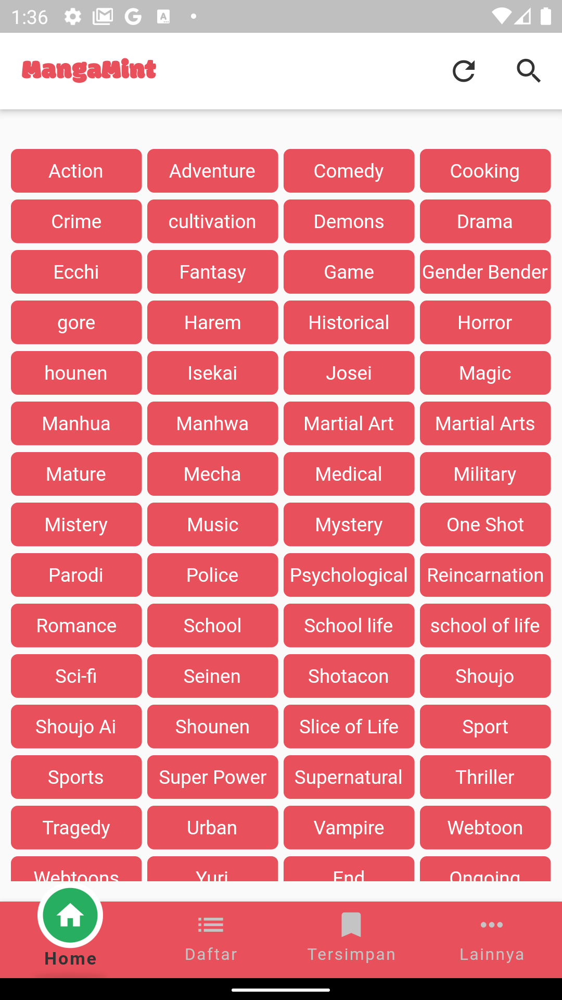
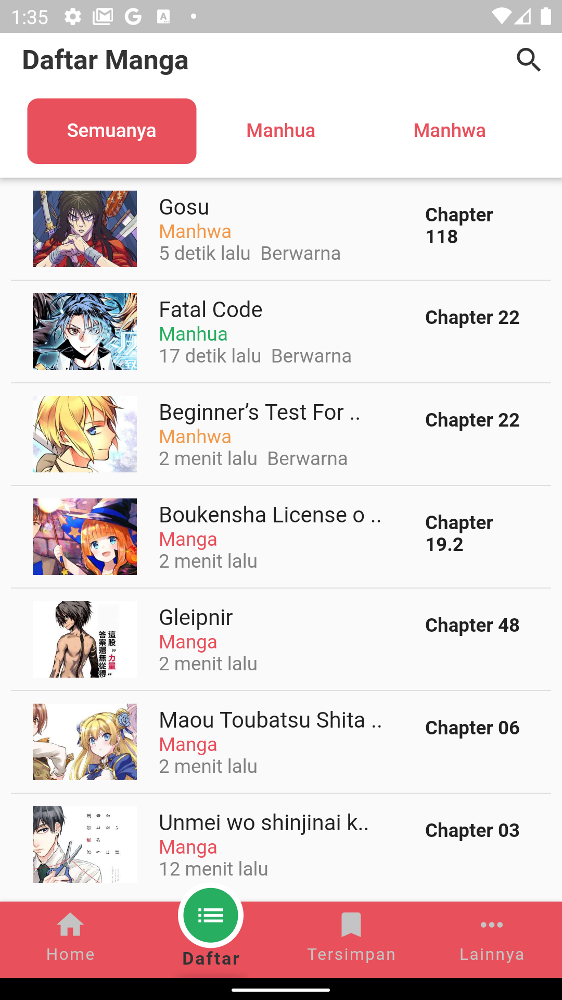
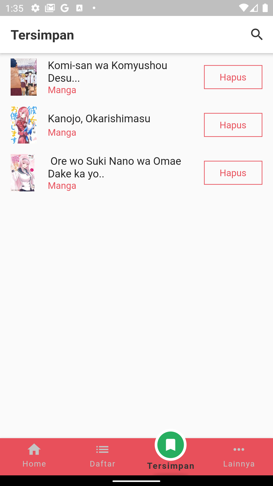
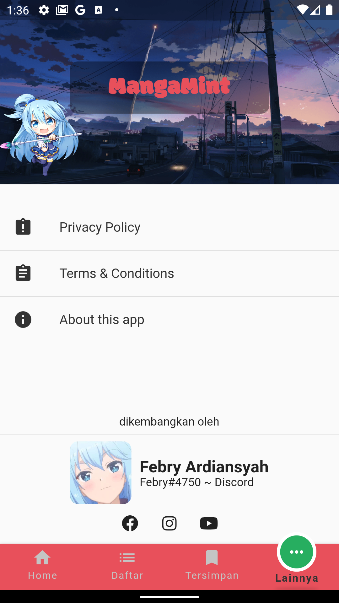
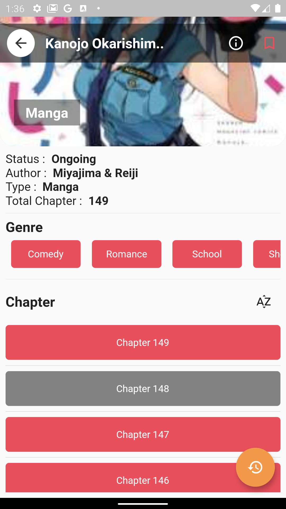

# MangaMint

MangaMint is manga reader application that provides manga and comic bahasa indonesia and currently
available on android only, idk in the future will be available on ios or not


## Features
- [x] Manga List (Japanase Comic)
- [x] Manhua List (Chinese Comic)
- [x] Manhwa List (Korean Comic)
- [x] Last chapter update
- [x] Bookmarks Manga
- [x] Read last chapter opened
- [x] Search Manga by name and Genres
- [x] Read chapter vertically or horizontally

## Screenshot
 
 
 
 

## Build Setup
``` bash

# install dependencies
$ flutter pub get

# run debug mode
$ flutter run

# run release mode
$ flutter run --release

# build app bundle
$ flutter build appbundle

# build apk
$ flutter build apk

```
## Dependencies that i use
- http: ^0.12.1
- bloc: ^5.0.1
- flutter_bloc: ^5.0.1
- google_fonts: ^1.1.0
- equatable: ^1.2.0
- rxdart: ^0.24.1
- ff_navigation_bar: ^0.1.5
- flutter_spinkit: ^4.1.2+1
- shimmer: ^1.1.1
- carousel_slider: ^2.2.1
- flutter_screenutil: ^2.2.0
- cached_network_image: ^2.2.0+1
- photo_view: ^0.9.2
- shared_preferences: ^0.5.8
- path_provider: ^1.6.11
- path: ^1.7.0
- hive: ^1.4.1+1
- hive_flutter: ^0.2.1
- toast: ^0.1.5
- font_awesome_flutter: ^8.8.1
- url_launcher: ^5.5.0

For detailed explanation on how things work, check out [Flutter docs](https://flutter.dev/docs).

